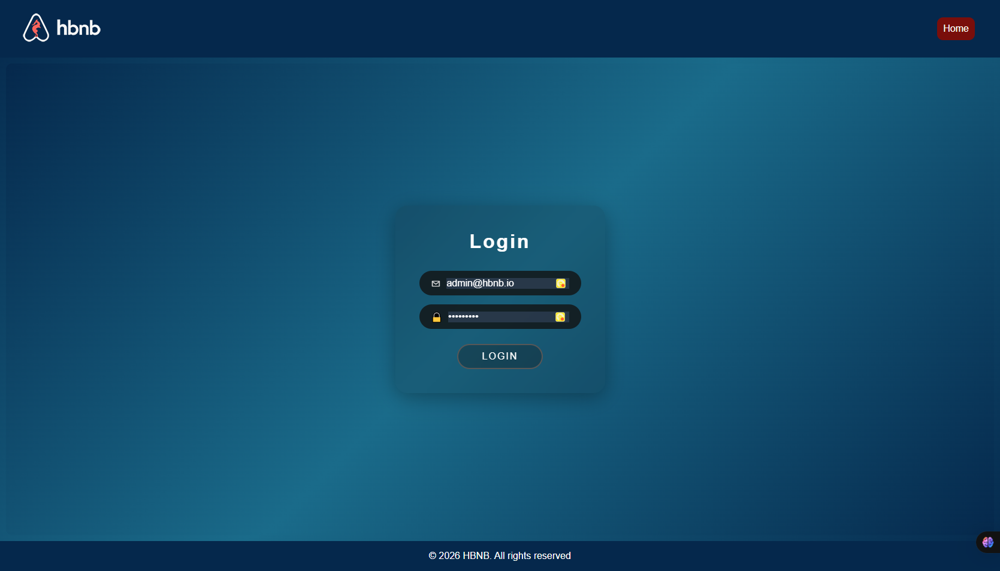
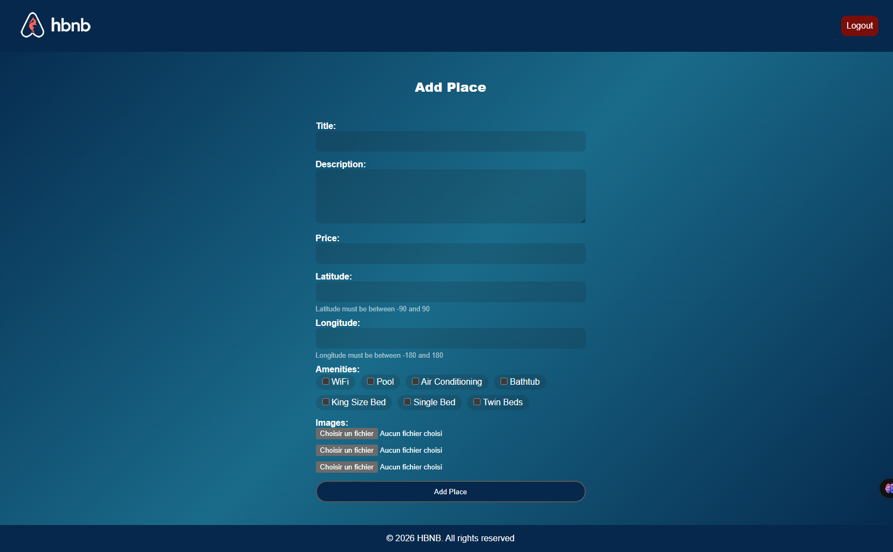
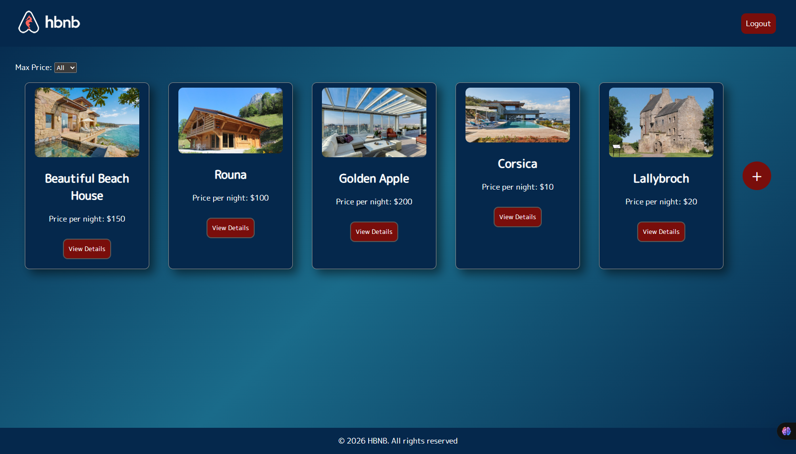
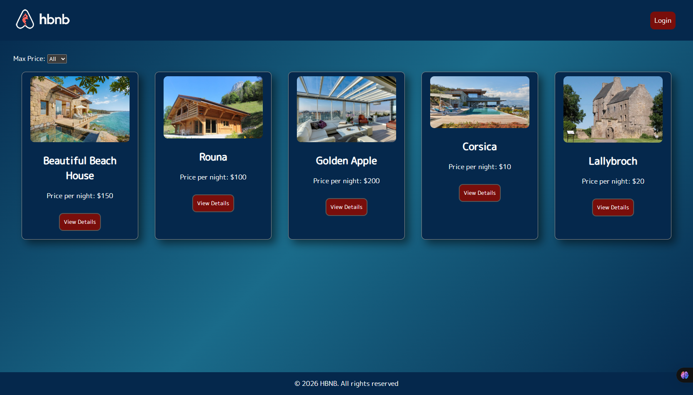
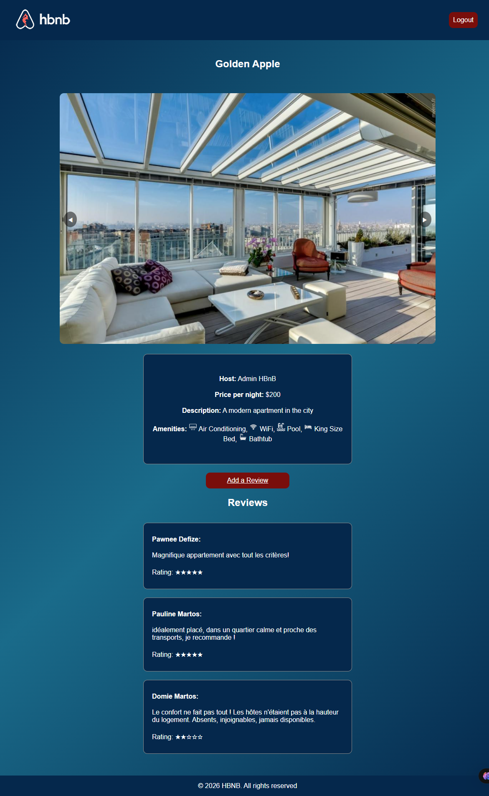
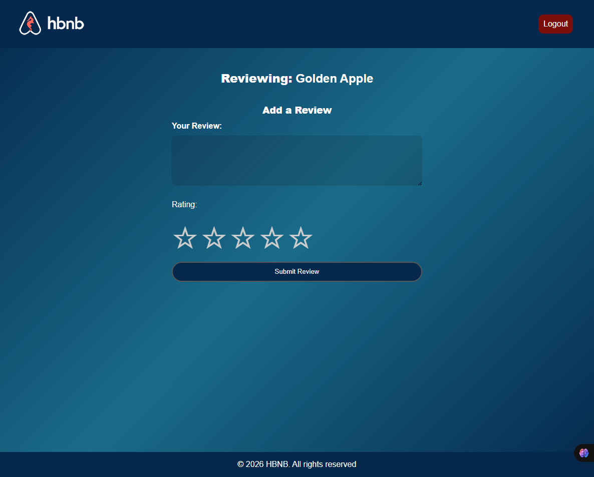

# Part 4 - Simple Web Client

## Overview

This part focuses on the **front-end development** of the HBnB application using **HTML5**, **CSS3**, and **JavaScript ES6**.  
The goal is to build an interactive user interface that connects to the back-end API developed in the previous parts of the project.

---
## Screenshots

### Login Page


### Add Places


### List of Places Admin


### List of Places


### Place Details


### Add Review


---

## Project Structure

```
part4/
├── index.html          # Main page — list of places
├── login.html          # Login page
├── place.html          # Place details page
├── add_review.html     # Add review form page
├── scripts.js          # All client-side JavaScript logic
└── styles.css          # Application styles
```

---

## Pages

| Page | File | Description |
|---|---|---|
| Login | `login.html` | Form with email and password fields |
| List of Places | `index.html` | Displays all available places as cards |
| Place Details | `place.html` | Detailed view of a place with reviews |
| Add Review | `add_review.html` | Form to submit a review (authenticated users only) |

---

## Tasks

### Task 0 — Design

Complete the provided HTML and CSS files to match the design specifications.

**Requirements:**
- Use semantic HTML5 elements for each page.
- All pages must include a **header** with the app logo and a login/logout button, and a **footer**.
- Place cards must use the class `place-card` and include name, price per night, and a `details-button`.
- Place details must use classes `place-details` and `place-info`.
- Review cards must use the class `review-card`.
- Cards must follow these fixed parameters:
  - Margin: `20px`
  - Padding: `10px`
  - Border: `1px solid #ddd`
  - Border radius: `10px`

---

### Task 1 — Login

Implement the login flow using the back-end API.

**What it does:**
- Listens for the login form submission.
- Sends a `POST` request to `POST /api/v1/auth/login` with email and password.
- On success: stores the JWT token in a cookie (`token`) and redirects to `index.html`.
- On failure: displays an error alert.

**Key function:** `loginUser(email, password)`

---

### Task 2 — List of Places

Implement the main page to display all available places.

**What it does:**
- On page load, checks if the user is authenticated (JWT token in cookie).
- If authenticated: fetches all places from `GET /api/v1/places/` and renders them as cards.
- If not authenticated: shows the login link and hides the logout button.
- Implements a **client-side price filter** (dropdown: 10 / 50 / 100 / All) without reloading the page.

**Key functions:** `fetchPlaces(token)`, `displayPlaces(places)`

---

### Task 3 — Place Details

Implement the detailed view for a single place.

**What it does:**
- Extracts the place ID from the URL query parameter (`?id=...`).
- Checks authentication and fetches place details from `GET /api/v1/places/:id`.
- Displays: title, image slider, host, price, description, amenities (with icons), and reviews (with star ratings).
- Shows the **Add Review** section only if the user is authenticated.

**Key functions:** `fetchPlaceDetails(token, placeId)`, `displayPlaceDetails(place)`

---

### Task 4 — Add Review

Implement the review submission form.

**What it does:**
- Checks authentication on page load — redirects unauthenticated users to `index.html`.
- Retrieves the place ID from the URL.
- Listens for the review form submission.
- Sends a `POST` request to `POST /api/v1/reviews/` with the review text, rating, and place ID.
- On success: shows a confirmation alert, resets the form, and redirects back to `place.html?id=...`.
- On failure: displays an error alert.

**Key functions:** `submitReview(token, placeId, reviewText, rating)`, `handleResponse(response, placeId)`

---

## Authentication Flow

```
User visits page
       │
       ▼
checkAuthentication()
       │
  token in cookie?
       │
  ┌────┴────┐
 No        Yes
  │          │
Show       Hide login link
login link  Show logout button
Hide        Fetch data from API
add-review
```

JWT token is stored in a browser cookie named `token` after a successful login, and deleted on logout.

---

## API Endpoints Used

| Method | Endpoint | Usage |
|---|---|---|
| `POST` | `/api/v1/auth/login` | Authenticate the user |
| `GET` | `/api/v1/places/` | Fetch the list of all places |
| `GET` | `/api/v1/places/:id` | Fetch details of a specific place |
| `POST` | `/api/v1/reviews/` | Submit a new review |

All requests to protected endpoints include the JWT token in the `Authorization: Bearer <token>` header.

---

## CORS Warning

> **When testing the client against your API, you will likely encounter a Cross-Origin Resource Sharing (CORS) error.**  
> You need to configure your Flask API to allow requests from the client's origin.  
> See this guide for how to configure CORS in a Flask API:  
> https://medium.com/@mterrano1/cors-in-a-flask-api-38051388f8cc

---
## Authors
* Pawnee DEFIZE: https://github.com/Pawnee33